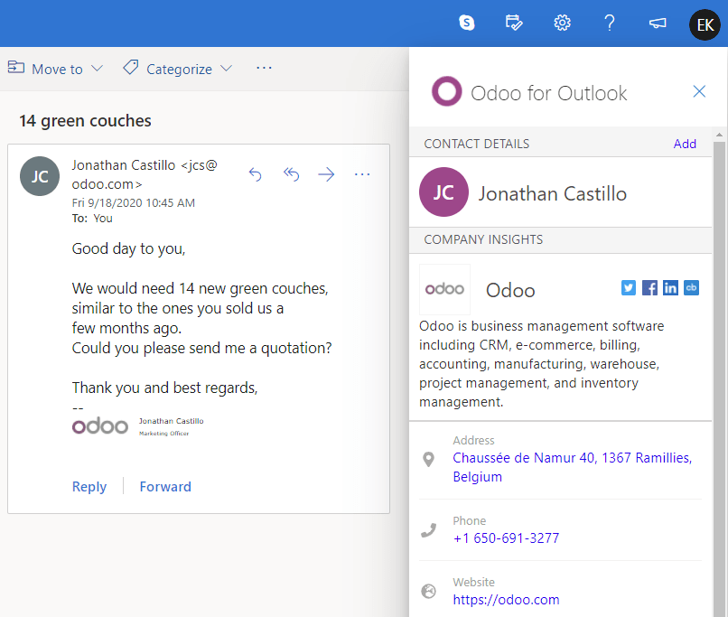

=================
Outlook Extension
=================

The **Odoo CRM Extension** is a connector that bridges your Outlook mailbox with your Odoo database.
This extension allows you to:

- Create leads from Emails sent to your personal email address.
- Centralize Prospects' emails into a CRM.
- Search and store insights on your contacts.

.. _outlook_extension/configuration:

Configuration
=============

The Outlook Extension requires to be configured both in Odoo and in Outlook.

.. _outlook_extension/enable-feature:

Enable the feature on your database
-----------------------------------

To enable this feature on your Odoo database, go to :menuselection:`CRM --> Configuration --> Lead
Generation`, enable **Outlook CRM Extension**, and click on *Save*.

.. _outlook_extension/add-in-installation:

Install the add-in on Outlook
-----------------------------

You can install the Outlook Extension as a **Custom Add-in**. To do so, follow these steps:

.. important::
   | URL of the **Odoo for Outlook** add-in's manifest file:
   | :file:`https://download.odoo.com/plugins/outlook/manifest.xml`

   .. todo:: add copy button when the feature is added to the doc

#. Connect to your Outlook mailbox, open any email, and click on the *More actions* button,
   displayed as three little dots.

   .. image:: media/outlook-extension-more-actions.png
      :align: center
      :alt: The button "More actions" in Outlook

#. Click on *Get add-ins*.

   .. image:: media/outlook-extension-get-add-ins.png
      :align: center
      :alt: List of actions in Outlook, including the installation of new add-ins

#. In the new window, select the tab named *My add-ins*, click on *+ Add a custom add-in*, and then
   on *Add from URL...*

   .. image:: media/outlook-extension-custom-add-ins.png
      :align: center
      :alt: Installation of a custom add-in in Outlook

#. | Outlook prompts you to **enter the URL of the add-in's manifest file**. To do so, copy the
     following URL, paste it in the box, and click on *OK*.
   | :file:`https://download.odoo.com/plugins/outlook/manifest.xml`

   .. image:: media/outlook-extension-add-in-url.png
      :align: center
      :alt: Getting a custom add-in in Outlook by providing the manifest file's URL

#. Outlook warns you that Microsoft hasn’t verified the add-in. Click on *Install* to complete the
   installation.

.. note::
   The *Odoo for Outlook* add-in is not listed in Outlook yet on Outlook's add-ins list. That is
   why it is currently necessary to install it as a *custom add-in*.

.. _outlook_extension/connection:

Connect to your database
------------------------

#. Open any email, click on the *More actions* button (displayed as three little dots), and then on
   **Odoo for Outlook**. This opens the add-in as a panel on the right side of your screen.

   .. image:: media/outlook-extension-open.png
      :align: center
      :alt: Opening Odoo for Oultook add-in

#. Click on *login* at the bottom of the extension.
#. Insert your database's URL then click on *Login*.

   .. image:: media/outlook-extension-database-url.png
      :align: center
      :alt: Connection to an Odoo database from the Outlook extension

#. Log into your database by entering your credentials. Skip this step if you are already logged in
   with this browser.
#. A message asks you if you want to let Outlook access your Odoo database? Click on *Allow* to
   complete the connection.

   .. important::
      Make sure first to :ref:`enable the feature on your database
      <outlook_extension/enable-feature>`. Failing to do so would result in an *error 404 message*.